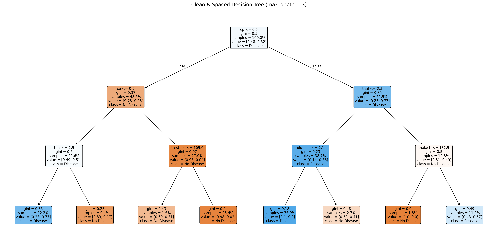
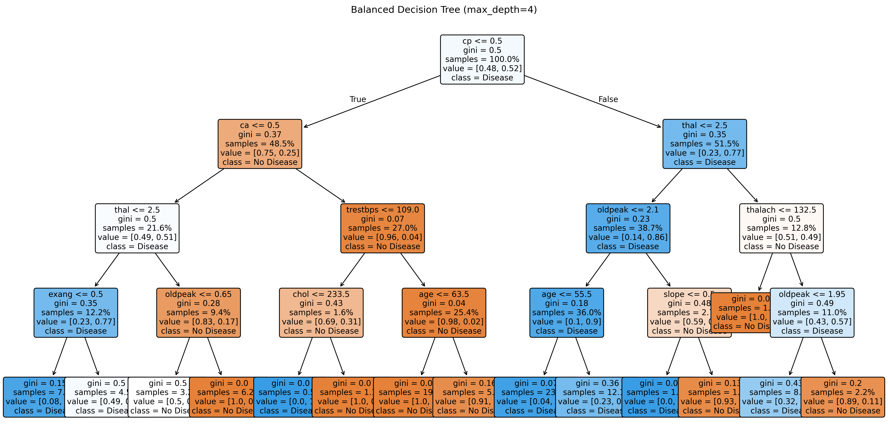
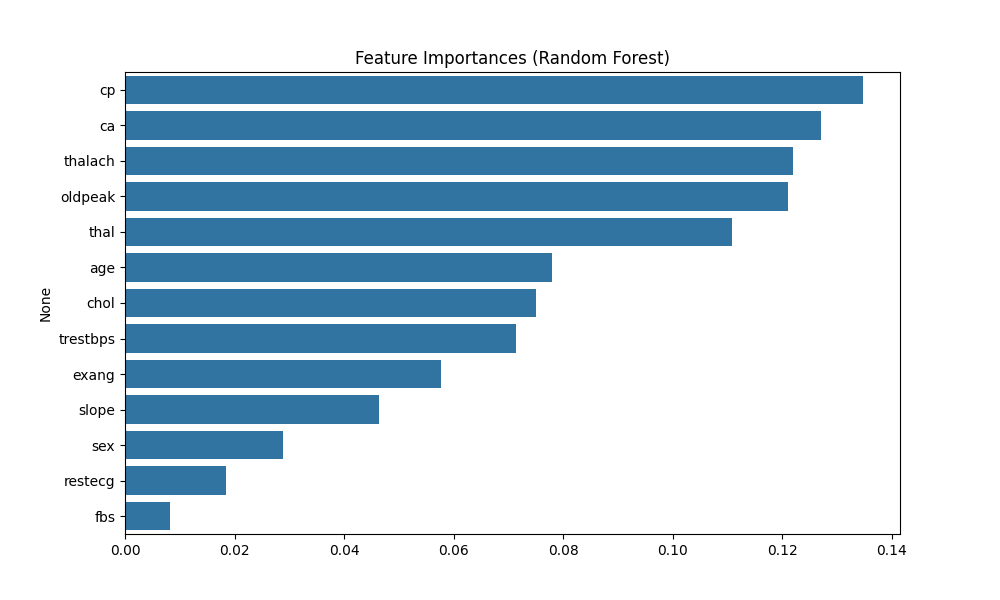

# 🌳 Task 5: Decision Tree & Random Forest Classifier - Heart Disease Prediction

This project uses **Decision Tree** and **Random Forest** classifiers to predict the presence of heart disease from a dataset containing patient health attributes.

---

## 📁 Dataset

* Source: [Heart Disease Dataset - Kaggle](https://www.kaggle.com/datasets/johnsmith88/heart-disease-dataset)
* File: `heart.csv`

---

## 🎯 Objective

* Train a **Decision Tree** classifier and visualize it
* Use **Random Forest** for improved performance
* Evaluate with metrics and plots
* Plot feature importances
* Tune tree parameters to avoid overfitting

---

## 📊 Workflow

### 1. 📦 Preprocessing

* No missing values in the dataset
* Target: `target` (0 = No Disease, 1 = Disease)

### 2. 🚀 Models Used

* `DecisionTreeClassifier`
* `RandomForestClassifier`

### 3. 📈 Evaluation Metrics

* Accuracy
* Classification Report (Precision, Recall, F1-score)
* Confusion Matrix
* Cross-Validation Scores

---

## 📌 Results

### ✅ Cleaned Decision Tree (max\_depth=3)



### ✅ Balanced Decision Tree (max\_depth=4)



### ✅ Feature Importances (Random Forest)



---

## 🔍 Observations

* Random Forest consistently outperformed single decision tree
* `thal`, `ca`, and `oldpeak` were among the top predictors
* Controlled `max_depth` helped avoid overfitting in trees

---

## 🧠 Interview Prep Q\&A

**1. What is a decision tree?**
A flowchart-like structure that splits data by feature values to make predictions.

**2. What is entropy or Gini index?**
Metrics to evaluate impurity of a node. Gini is commonly used in `sklearn`.

**3. What is overfitting in decision trees?**
Occurs when the tree memorizes training data. Prevent using pruning (`max_depth`, `min_samples_leaf`).

**4. What is bagging?**
Bootstrapped Aggregation — training multiple models on random subsets and averaging their results.

**5. Why is Random Forest better than a single tree?**
More robust, less variance, better generalization.

**6. How do you visualize a decision tree?**
Using `plot_tree()` or exporting with `graphviz`.

**7. How do you interpret feature importance?**
Shows which features contribute most to decisions. Useful for feature selection.

**8. When should you use Random Forests?**
For complex problems where interpretability is less important than performance.

---

## 🛠 Tech Stack

* Python 3.9+
* pandas, matplotlib, seaborn
* scikit-learn
* Jupyter Notebook

---

## 📂 Project Structure

```
task-5-decision-tree-rf/
├── heart.csv
├── Task_5_DecisionTree_RandomForest.ipynb
├── clean-decision-tree.png
├── balanced-decision-tree.png
├── feature-importances.png
├── decision_tree_model.pkl
└── README.md
```

---

## 👨‍💻 Author

**Manish Kumar Srivastav**
🔗 [LinkedIn](https://www.linkedin.com/in/manish-kumar-srivastav)
🐙 [GitHub](https://github.com/Roxtop07)
